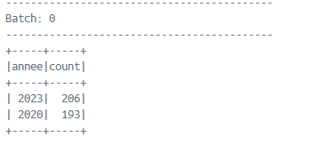
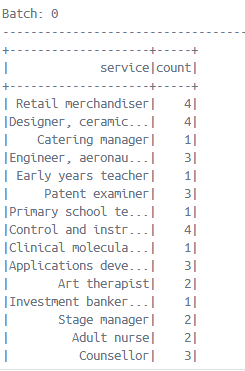
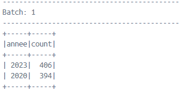
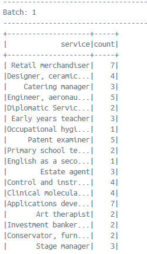

# **Application Spark de Gestion des Incidents de l'Hôpital en Streaming**

## **Contexte**
L'objectif de ce projet est de créer une application Spark qui reçoit les incidents de l'hôpital en streaming. Ces incidents sont fournis sous forme de fichiers CSV, contenant des informations telles que l'ID, le titre, la description, le service, et la date de l'incident. L'application utilise **Structured Streaming** d'Apache Spark pour traiter ces fichiers en temps réel.

### **Fonctionnalités**
1. Afficher de manière continue le nombre d'incidents par service.
2. Afficher de manière continue les deux années ayant connu le plus grand nombre d'incidents.

## **Architecture**
Le projet utilise une architecture Docker avec :
- **Apache Spark** pour le traitement en streaming des données.
- **Apache Hadoop** pour le stockage distribué des fichiers CSV via HDFS.
- Un réseau **Docker** pour la communication entre les services Spark et Hadoop.

### **Composants** :
- **Spark Master** : Serveur principal de gestion des jobs Spark.
- **Spark Worker** : Worker pour exécuter les tâches Spark.
- **Hadoop Namenode** : Serveur principal de gestion des fichiers HDFS.
- **Hadoop Datanode** : Serveur de stockage des fichiers HDFS.

## **Prérequis**
Avant de lancer l'application, assurez-vous d'avoir Docker et Docker Compose installés sur votre machine.

1. **Docker** : [Installation de Docker](https://docs.docker.com/get-docker/)
2. **Docker Compose** : [Installation de Docker Compose](https://docs.docker.com/compose/install/)

## **Installation**

1. **Clonez le repository** (ou téléchargez le projet) dans votre environnement local.
   ```bash
   git clone <url-du-repository>
   cd <dossier-du-projet>
   ```

2. **Assurez-vous que le dossier `csv_files` contient des fichiers CSV** avec les colonnes suivantes :
   - **Id** : Identifiant unique de l'incident
   - **Titre** : Titre de l'incident
   - **Description** : Description détaillée de l'incident
   - **Service** : Service concerné par l'incident
   - **Date** : Date de l'incident au format `yyyy-MM-dd`

3. **Construisez et lancez les containers Docker** avec Docker Compose :
   ```bash
   docker-compose up --build
   ```

   Cette commande va créer et démarrer tous les services nécessaires (Spark Master, Spark Worker, Hadoop Namenode, Hadoop Datanode).

## **Lancer l'Application Spark**

Une fois les containers lancés, l'application Spark sera exécutée. Les incidents en streaming seront traités et affichés continuellement dans la console.

### **Vérification des résultats**
- **Nombre d'incidents par service** : Les résultats seront affichés dans la console sous forme de tableau avec le nombre d'incidents pour chaque service.
- **Les deux années avec le plus d'incidents** : Les deux années ayant le plus grand nombre d'incidents seront affichées en continu dans la console.

## **Code du Programme**

Voici une description succincte du code de l'application **`StreamingApp.java`** :

### **Chargement des Données**
Le programme commence par lire les fichiers CSV en streaming depuis un répertoire HDFS monté sur le conteneur Hadoop. Le schéma des données est défini pour correspondre aux colonnes des fichiers CSV.

```java
StructType schema = new StructType(new StructField[] {
        DataTypes.createStructField("Id", DataTypes.IntegerType, true),
        DataTypes.createStructField("titre", DataTypes.StringType, true),
        DataTypes.createStructField("description", DataTypes.StringType, true),
        DataTypes.createStructField("service", DataTypes.StringType, true),
        DataTypes.createStructField("date", DataTypes.StringType, true)
});

Dataset<Row> incidents = spark.readStream()
        .format("csv")
        .schema(schema)
        .option("header", "true")
        .load("hdfs://namenode:8020/user/hadoop/csv_data/");
```

### **Agrégation des Données**
Les incidents sont agrégés par **service** et par **année** :
- Le nombre d'incidents par service est calculé avec `groupBy("service").count()`.
- L'année de chaque incident est extraite et utilisée pour calculer le nombre d'incidents par année, les années sont triées pour afficher les deux années ayant le plus grand nombre d'incidents.

```java
Dataset<Row> incidentsParService = incidents.groupBy("service").count();
Dataset<Row> incidentsParAnnee = incidents
        .withColumn("date", to_date(col("date"), "yyyy-MM-dd"))
        .withColumn("annee", year(col("date")))
        .groupBy("annee")
        .count()
        .orderBy(col("count").desc())
        .limit(2);
```

### **Flux de Sortie**
Les résultats sont envoyés en continu vers la console avec `writeStream()`.

```java
incidentsParService.writeStream()
        .format("console")
        .outputMode("complete")
        .queryName("IncidentsParService")
        .start();

incidentsParAnnee.writeStream()
        .format("console")
        .outputMode("complete")
        .queryName("IncidentsParAnnee")
        .start();
```

## **Docker Compose Configuration**

Le fichier `docker-compose.yml` définit les services nécessaires, y compris Spark et Hadoop. Le répertoire contenant les fichiers CSV est monté dans le conteneur Hadoop, et les résultats de l'application Spark sont affichés dans la console.

```yaml
services:
  spark-master:
    image: bitnami/spark:latest
    container_name: spark-master
    ports:
      - "8080:8080"
      - "7077:7077"
    volumes:
      - ./app:/opt/spark-app
    networks:
      - spark-network
  spark-worker-1:
    image: bitnami/spark:latest
    container_name: spark-worker-1
    depends_on:
      - spark-master
    volumes:
      - ./app:/opt/spark-app
    networks:
      - spark-network
  namenode:
    image: apache/hadoop:3.3.6
    hostname: hadoop-namenode
    command: [ "hdfs", "namenode" ]
    volumes:
      - ./csv_files:/opt/hadoop/csv_files
    networks:
      - spark-network
  datanode:
    image: apache/hadoop:3.3.6
    command: [ "hdfs", "datanode" ]
    volumes:
      - ./csv_files:/opt/hadoop/csv_files
    networks:
      - spark-network
```

## **Screenshots**

### **1. Démarrage de l'application Spark**


Cette capture d'écran montre comment démarrer l'application Spark après que tous les services Docker sont en cours d'exécution.

### **2. Résultats des incidents par service 1 batch**



Les incidents sont agrégés par service et affichés en continu dans la console. Cette capture montre les résultats pour les différents services de l'hôpital.

### **3. Résultats des deux années avec le plus d'incidents 1 batch**



Les deux années avec le plus grand nombre d'incidents sont affichées en temps réel dans la console.

### **4. Résultats des incidents par service 2 batch**


### **5. Résultats des deux années avec le plus d'incidents 2 batch**


## **Conclusion**
Cette application permet de traiter les incidents de l’hôpital en temps réel en utilisant **Structured Streaming** dans Apache Spark. Les résultats sont affichés continuellement, fournissant une vue en temps réel des incidents par service et des années ayant connu le plus grand nombre d’incidents.
